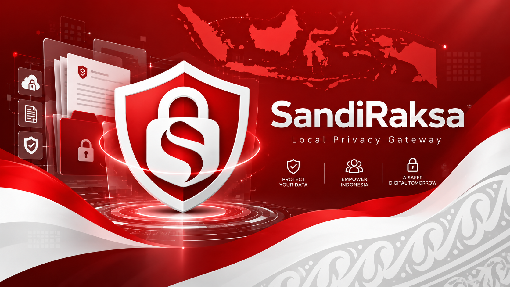

<p align="center">
  
</p>

# Panduan Pengguna SandiRaksa

SandiRaksa adalah aplikasi desktop untuk melindungi data sensitif sebelum dibagikan ke layanan AI (ChatGPT, Claude, Gemini, dll). **Semua pemrosesan dilakukan secara lokal** di komputer Anda — tidak ada data yang dikirim ke server manapun.

> Panduan ini menjelaskan cara menggunakan aplikasi. Untuk instalasi, build, dan pengembangan, lihat [README utama](../README.md).

---

## Daftar Isi

1. [Memulai](#memulai)
2. [Mengelola Proyek](#mengelola-proyek)
3. [Memindai Dokumen](#memindai-dokumen)
4. [Deteksi Kolom Otomatis (Excel/CSV)](#deteksi-kolom-otomatis-excelcsv)
5. [Pola Kustom (Global)](#pola-kustom-global)
6. [Meninjau Temuan](#meninjau-temuan)
7. [Melindungi Data](#melindungi-data)
8. [Memulihkan Data](#memulihkan-data)
9. [Format yang Didukung](#format-yang-didukung)
10. [Tipe Data yang Terdeteksi](#tipe-data-yang-terdeteksi)
11. [Tentang Token](#tentang-token)
12. [Tanya Jawab](#tanya-jawab)

---

## Memulai

1. Buat proyek baru lewat **File → Proyek Baru**
2. Beri nama proyek dan pilih profil privasi
3. Tambahkan file dengan drag & drop atau tombol **Tambah File**
4. Klik **Pindai Semua** untuk mendeteksi data sensitif
5. Tinjau temuan dan pilih tindakan
6. Klik **Terapkan Perlindungan** untuk menghasilkan file yang dilindungi

---

## Mengelola Proyek

Proyek membantu mengorganisir file dan menjaga konsistensi token antar pemindaian.

**Membuat proyek:**
1. Klik **File → Proyek Baru** atau tombol **+**
2. Isi nama proyek
3. Pilih profil privasi yang sesuai
4. Klik **Simpan**

> 💡 **Tips:** Gunakan proyek terpisah untuk konteks berbeda (mis. proyek A untuk HR, proyek B untuk keuangan) agar token tidak tercampur.

---

## Memindai Dokumen

Pemindaian mendeteksi data sensitif menggunakan:

- Pola untuk format Indonesia (NIK, NPWP, No. KK, BPJS, nomor HP)
- **Deteksi nama orang berbasis konteks** — mengenali nama dari label "Nama:", pola baris rekam medis (EMR), dan header kolom tabel
- **Deteksi tanggal lahir cerdas** — membedakan tanggal lahir dari tanggal kunjungan/janji temu
- **Pola Kustom** yang Anda definisikan sendiri

**Langkah pemindaian:**
1. Tambahkan file ke proyek
2. Untuk Excel/CSV: pilih kolom yang akan dilindungi (kolom sensitif direkomendasikan otomatis)
3. Klik **Pindai Semua**
4. Tunggu proses selesai
5. Tinjau hasilnya

---

## Deteksi Kolom Otomatis (Excel/CSV)

Untuk file Excel dan CSV, perlindungan dilakukan **per kolom**. SandiRaksa merekomendasikan kolom mana yang berisi data sensitif berdasarkan:

1. **Nama header** — mis. kolom "Nama Pasien", "Email", "NIK", "Tanggal Lahir"
2. **Isi kolom** — jika nama header tidak jelas, SandiRaksa menganalisis contoh isi kolom (mis. mengenali kolom berisi email, NIK, nomor telepon, atau pola kustom)

Kolom yang direkomendasikan akan otomatis tercentang. Anda tetap bisa menambah atau membatalkan pilihan secara manual sebelum memindai.

> 💡 Kolom seperti "Patient ID", "Status Pasien", atau "Jenis Kelamin" **tidak** ditandai sebagai sensitif karena bukan data pribadi langsung.

---

## Pola Kustom (Global)

Setiap organisasi bisa punya format data sendiri, misalnya Nomor Rekam Medis yang berbeda di tiap rumah sakit. Anda bisa mendefinisikan pola sendiri yang berlaku untuk **semua proyek**.

**Cara membuat pola kustom:**
1. Buka menu **Pengaturan → Pola Kustom...**
2. Tulis pola dengan format `NAMA: pola` (satu pola per baris)
3. Klik **Validasi** untuk memeriksa, lalu **Simpan**

**Contoh:**

```
REKAM_MEDIS: MR-\d{6}
NO_KAMAR: (?:Kamar|Room)\s?\d+
ID_PEGAWAI: EMP-\d{4,6}
```

- Pola ditulis sebagai **regular expression**.
- Baris diawali `#` dianggap komentar.
- **Opsional** — jika dikosongkan, deteksi standar tetap berjalan normal.

---

## Meninjau Temuan

Setelah pemindaian, Anda dapat meninjau setiap temuan:

- **Lindungi** — Ganti dengan token (default)
- **Abaikan** — Biarkan apa adanya
- **Ubah Tipe** — Koreksi tipe entitas

> 📝 Keputusan Anda disimpan dan diterapkan konsisten untuk nilai yang sama di seluruh proyek.

---

## Melindungi Data

Perlindungan mengganti data sensitif dengan token deterministik.

**Contoh:**

```
Sebelum: Budi Santoso lahir 14-Feb-1988, email budi@abc.com
Sesudah: [[PERSON_7F31A2]] lahir [[DATE_OF_BIRTH_9C4B12]], email [[EMAIL_3D2F1C]]
```

File hasil disimpan dengan akhiran `_protected` (mis. `laporan_protected.docx`) di folder output yang Anda tentukan.

---

## Memulihkan Data

Setelah menerima output dari AI, Anda dapat memulihkan data asli:

1. Buka menu **Pulihkan**
2. Tempel teks yang mengandung token
3. Klik **Pulihkan**
4. Salin hasil yang sudah dikembalikan

> ⚠️ **Penting:** Pemulihan hanya berfungsi untuk token dari proyek yang sama. Jangan mencampur token dari proyek berbeda.

---

## Format yang Didukung

| Format | Ekstensi | Fitur |
|--------|----------|-------|
| CSV | `.csv` | Deteksi encoding otomatis, rekomendasi kolom |
| Excel | `.xlsx`, `.xls` | Multi-sheet, perlindungan per kolom |
| Word | `.docx` | Paragraf, tabel, header/footer |
| PowerPoint | `.pptx` | Slide, text frame, tabel, catatan |
| Teks | `.txt` | Deteksi berbasis pola dan konteks |

---

## Tipe Data yang Terdeteksi

### Data Indonesia
- **ID_NIK** — Nomor Induk Kependudukan (16 digit)
- **ID_NPWP** — Nomor Pokok Wajib Pajak
- **ID_KK** — Nomor Kartu Keluarga
- **ID_BPJS** — Nomor BPJS Kesehatan
- **ID_PHONE** — Nomor telepon Indonesia

### Data Pribadi & Internasional
- **PERSON** — Nama orang (deteksi berbasis konteks)
- **DATE_OF_BIRTH** — Tanggal lahir (dibedakan dari tanggal kunjungan)
- **EMAIL** — Alamat email
- **PHONE** — Nomor telepon umum
- **ADDRESS** — Alamat
- **ORGANIZATION** — Nama organisasi
- **CREDIT_CARD** — Nomor kartu kredit
- **BANK_ACCOUNT** — Nomor rekening
- **IP_ADDRESS** — Alamat IP

### Tipe Kustom
- **Pola Kustom** — Tipe apa pun yang Anda definisikan lewat menu **Pengaturan → Pola Kustom** (mis. REKAM_MEDIS, NO_KAMAR, ID_PEGAWAI)

---

## Tentang Token

Token adalah placeholder yang menggantikan data sensitif. Format: `[[TIPE_HEXID]]`

**Karakteristik token:**
- **Deterministik** — Nilai yang sama selalu menghasilkan token yang sama
- **Unik per proyek** — Token berbeda antar proyek
- **Tidak dapat ditebak** — ID menggunakan HMAC, bukan urutan sekuensial
- **Reversibel** — Dapat dikembalikan ke nilai asli

---

## Tanya Jawab

**Apakah data saya dikirim ke internet?**
Tidak. Semua pemrosesan 100% lokal di komputer Anda. Tidak ada telemetri atau upload dokumen.

**Bagaimana kalau nama/tanggal lahir tidak terdeteksi?**
Pastikan format dokumen jelas (mis. ada label "Nama:", header kolom, atau pola EMR). Untuk format khusus organisasi, gunakan **Pola Kustom**.

**Apakah harus mengisi Pola Kustom?**
Tidak. Pola Kustom opsional. Deteksi standar tetap berjalan meski dikosongkan.

**Apakah token bisa dikembalikan di komputer lain?**
Hanya jika proyek (beserta vault-nya) tersedia. Token terikat ke proyek dan kunci enkripsinya.

---

<p align="center">
  <small>SandiRaksa v1.0.1 • Semua pemrosesan dilakukan secara lokal</small>
</p>
